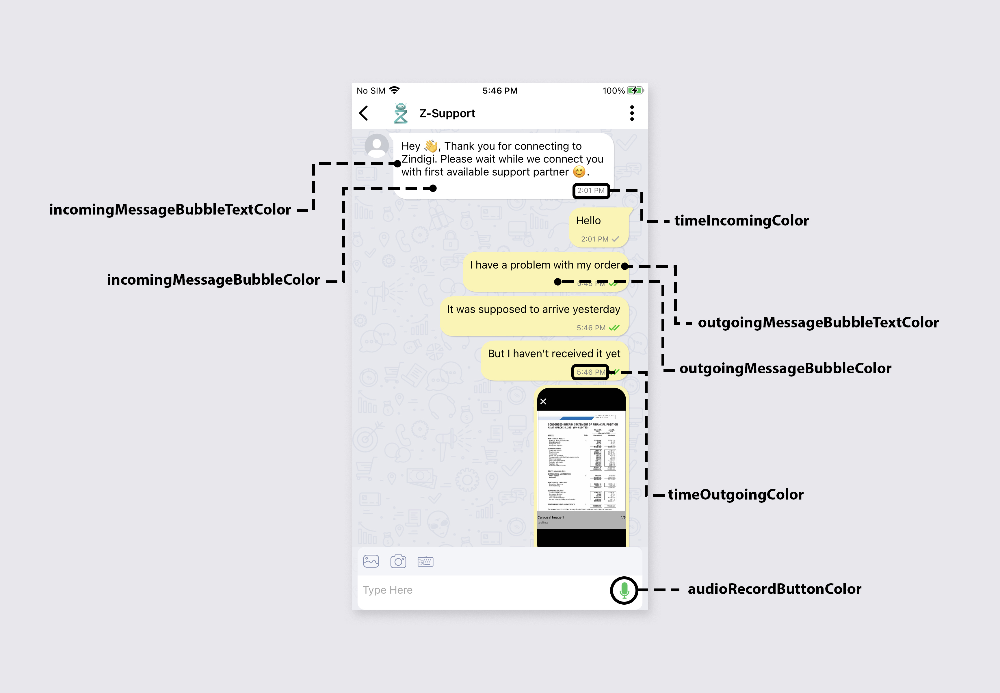

# TelloTalk Android Chat SDK

TelloTalk Android Chat SDK is a comprehensive solution for integrating a ready-made chatting system into your Android applications seamlessly.

## Features

- Easy integration for instant messaging functionality.
- Customizable UI elements for a personalized chat experience.
- Support for multimedia messaging, including text, images, videos, and files.
- Real-time updates and notifications for an interactive user experience.

## Requirements

To use the SDK, you'll need the following:

- **Access Key**: `<YOUR_ACCESS_KEY>`
- **Project Token**: `<YOUR_PROJECT_TOKEN>`
  
## Installation
Installation can be done either remotely via maven or using aar locally.

### 1. Maven Integration(Recommended)

To integrate via Maven, add the following dependency in your app's `build.gradle` file:

Add the token to $HOME/.gradle/gradle.properties

```gradle
authToken=jp_p6dmteat0vu8e805pm7dl1k5c0
```

```gradle
dependencies {
    implementation 'com.github.tellotalksdk:tellotalksdk_corporate_chat:3.9.2'
}
```

Ensure that you have the Maven repository URL added to your project's repositories in Project level `build.gradle` file:

```gradle
allprojects {
    repositories {
        ...
        maven {
            url "https://jitpack.io"
            credentials { username authToken }
        }
    }
 }
```

### 2. AAR File Integration

Download the AAR file from the following link:
[Version 3.9.2](https://ttsdk-release.s3.eu-west-1.amazonaws.com/android/3.9.2/tellotalksdk-3.9.2.aar)

To integrate using the AAR file, follow these steps:
1. Copy the downloaded AAR file into your project's `libs` directory.
2. Open your app level `build.gradle` file and add the following dependency:

```gradle
dependencies {
    implementation files('libs/tellotalksdk.aar')
}
```

3. In order for local aar to work you need to add it's dependencies in your app level `build.gradle` file

```gradle
    //SDK dependencies
    //android core
    implementation 'androidx.core:core:1.3.0'
    implementation 'androidx.appcompat:appcompat:1.0.0'
    implementation 'androidx.constraintlayout:constraintlayout:1.1.3'
    implementation 'androidx.cardview:cardview:1.0.0'
    implementation 'androidx.recyclerview:recyclerview:1.0.0'
    implementation "androidx.drawerlayout:drawerlayout:1.0.0"
    implementation 'androidx.exifinterface:exifinterface:1.0.0'
    implementation 'androidx.browser:browser:1.0.0'

    //material design
    implementation 'com.google.android.material:material:1.3.0-alpha03'
    implementation 'com.google.android.flexbox:flexbox:3.0.0'

    //Image Handling
    implementation('com.facebook.fresco:fresco:2.0.0')

    //retrofit for network
    implementation 'com.squareup.retrofit2:retrofit:2.5.0'
    implementation 'com.squareup.retrofit2:converter-gson:2.5.0'
    implementation 'com.squareup.okio:okio:1.16.0'
    implementation 'com.squareup.okhttp3:okhttp:3.12.0'
    implementation 'com.squareup.okhttp3:logging-interceptor:3.9.1'

    //room database
    implementation 'androidx.room:room-runtime:2.0.0'
    annotationProcessor 'androidx.room:room-compiler:2.0.0'

    //android architecture
    implementation 'androidx.lifecycle:lifecycle-extensions:2.0.0'
    annotationProcessor 'androidx.lifecycle:lifecycle-compiler:2.0.0'
    implementation 'androidx.fragment:fragment-ktx:1.3.6'
    implementation 'androidx.lifecycle:lifecycle-viewmodel-ktx:2.3.1'

    //Jsoup
    implementation 'org.jsoup:jsoup:1.11.2'
```

## Configuration

To configure the SDK within your app, follow these steps:
1. **Initialize the SDK** in your Application class

    ```java
    public class YourApplication extends Application {
    
        @Override
        public void onCreate() {
            super.onCreate();
            
            // Initialize the SDK
            TelloApiClient.Builder builder = new TelloApiClient.Builder()
                                            .accessKey("<YOUR_ACCESS_KEY_HERE>")
                                            .projectToken("<YOUR_PROJECT_TOKEN_HERE>")
                                            .CRYPTO_LIB_KEY("<USE_PROVIDED_VALUES>")
                                            .CRYPTO_LIB_IV("<USE_PROVIDED_VALUES>")
                                            .setContext(getApplicationContext())
                                            .notificationIcon  ("<PROVIDE_DRAWABLE_RESOURCE_FOR_ICON_HERE>");
            //build sdk into singleton object to reference later via application class
            telloApiClient = builder.build();
        }
    }
    ```

    After initialization you can use **TelloApiClient** object to access SDK features. You can get the singleton instance of the client in the following way.

    ```java
    MyApplication.getInstance().getTelloApiClient()
    ```

2. **Register TelloTalkSDK** with a User

    Initiate SDK with a user to start receiving messages and to access chat interface (This is typically done in your main activity where you have access to uniquely identify your users.):

    ```java
    telloApiClient.registerUser(String profileId,
                                String name, String mobileNumber,
                                String customerType,
                                HashMap<String, String> hashMap,
                                OnSuccessListener<Boolean> successListener)
    ```

    In this method the `HashMap<String, String>` is optional.
    `OnSuccessListener` will return if user is register or not. If this method returns true, SDK will start receiving messages and you can access SDK user interface when needed.

3. **Set Locality**(Optional)

    TelloTalkSDK natively supports both English and Urdu layout. You can set the locality from the following method.
    ```java
    // en for english
    // ur for urdu
    telloApiClient.setLocality("en");
    ```
## USAGE

### Opening Chat Interface from TelloTalkSDK

There are 2 signatures for this function,

1. This will prompt users to select a department and will initiate a chat after the user selects one.

 ```java
 telloApiClient.openCorporateChat(Activity activity, String initiateMsg, String customData)
```

2. This will initiate a chat with the provided department instantly.

 ```java
 telloApiClient.openCorporateChat(Activity activity, String s, String customData, DepartmentConversations departmentConversations)
```

**Throws IllegalStateException:** If user is not loggedIn or if the feature is'nt supported from Business. It is recommended to write this function in a try/catch block to gracefully catch this exception.

### Get Department List

If you want to avoid the department selection prompt, you can get the department list from the following function.

```java
 List<DepartmentConversations> departmentList = telloApiClient.getDepartment()
```

### Get Unread Message Count

You can get unread messages count outside the SDK by implementing `MessageCounterListener` in a class and passing the instance of the class in the following way:
```java
telloApiClient.setMessageCounterListener(this);
```

### Get Click event on Buttons in Broadcast Message (Local Broadcast OR Local Broadcast with Keys) 

Button click events from inside SDK are fired through the Android's `LocalBroadcastManager`. You can register for an intent in the following way,
```java
private BroadcastReceiver mMessageReceiver = new BroadcastReceiver() {
    @Override
    public void onReceive(Context context, Intent intent) {
        // Get string data included in the Intent
        String message = String.valueOf(intent.getStringExtra("message"));
        Log.d("receiver", "Got message: " + message);
        
        // Get map data included in the Intent
        HashMap<String, String> map = new HashMap<String, String>();
        map = (HashMap<String, String>) intent.getSerializableExtra("key_value_map");
        Log.d("receiver", "Got map: " + map);
    }
};

LocalBroadcastManager.getInstance(this).registerReceiver(mMessageReceiver,
        new IntentFilter("custom-event-name"));
```

## Configuring Push Notifications

### Provide Access Key and Sender ID

In order to send FCM notifications to your application, we need credentials of your FCM service. Please ensure that you have provided the credentials on our [Admin Portal](https://admin.tellocast.com)

### Receiving Message Notifications
To receive messages notification using FCM you need to provide the updated FCM Token by using the following method:
```java
  telloApiClient.updateFcmToken(String fcmToken)
```

### Providing Notification Click Entry Point

Provide the entry point where the app should start when a user taps on a notification. Typically you'll be providing your splash activity package name here (e.g. `com.tellotalksdk.SplashActivity`).

```java
MyApplication.getInstance().telloApiClient.setPackageName("<>");
```

### Delegating Notification to TelloTalkSDK

When you receive FCM with data having entry **content-available-IM**, you'll have to call the `onMessageNotificationReceived` method of the `TelloApiClient`. A sample override implmentation of `onMessageReceived` is given below.

```java
private static final String CONTENT_AVAILABLE_IM = "content-available-IM";

@Override
public void onMessageReceived(RemoteMessage remoteMessage) {
    super.onMessageReceived(remoteMessage);
    if (remoteMessage.getData().size() > 0) {
        try {
            HashMap<String,String> map = new HashMap<>();
            map.putAll(remoteMessage.getData());
            
            String jobCode = map.get("jobCode");
            if (jobCode.equals(CONTENT_AVAILABLE_IM)) {
                MyApplication.getInstance().getTelloApiClient().onMessageNotificationReceived(map);
            }
        } catch (Exception e) {
            // Do your application specific notification handling here.
        }
    }
}
```

### Get Broadcast Notification Click event

You can get a notification click event by implementing `onNotificationClickListener` in a class and passing the instance of the class in the following way:
```java
telloApiClient.setNotificationCLickedListener(this);
```

### Get Broadcast Read more Click event

You can get a click event on load more link by implementing `setAnnouncementCLickedListener` in a class and passing the instance of the class in the following way:
```java
telloApiClient.setAnnouncementCLickedListener(this);
```

## Special Android Version Support

### Android 12 support

Add the following permissions in the manifest file.

```java
       <uses-permission android:name="android.permission.WRITE_EXTERNAL_STORAGE"
            android:maxSdkVersion="29"/>
    <uses-permission android:name="android.permission.READ_EXTERNAL_STORAGE" />

  <queries>
        <!-- Browser -->
        <intent>
            <action android:name="android.intent.action.VIEW" />
            <data android:scheme="http" />
        </intent>

        <!-- Camera -->
        <intent>
            <action android:name="android.media.action.IMAGE_CAPTURE" />
        </intent>

        <!-- Gallery -->
        <intent>
            <action android:name="android.intent.action.GET_CONTENT" />
        </intent>
    </queries>


```

### Android 11 support

If your Compile and Target SDK is above 28 (Android 9) in build.gradle. Then you should add Storage Permission Flag in your AndroidManifest.xml:
```java
<application
 android:requestLegacyExternalStorage="true"
   />
```

## Customizing UI

You can customize the app interface by changing color values of the following color resources. a diagram is show below to help you connect color names with their relevant usage in the UI.

```java
<color name="toolbar_color">#fdfdfc</color>
<color name="toolbar_title_text_color">#000000</color>
<color name="outgoingMessageBubbleColor">#FBF39A</color>
<color name="outgoingMessageBubbleTextColor">#FBF39A</color>
<color name="incomingMessageBubbleColor">#FBF39A</color>
<color name="incomingMessageBubbleTextColor">#FBF39A</color>
<color name="indicator">#009688</color>
<color name="float_buttons">#009688</color>
<color name="submit_button_vote">#FFE500</color>
<color name="timeOutgoingColor">#000000</color>
<color name="timeIncomingColor">#000000</color>
<color name="audioRecordButtonColor">#ffc62828</color>
<color name="messageButtonColor">#ffc62828</color>
```


