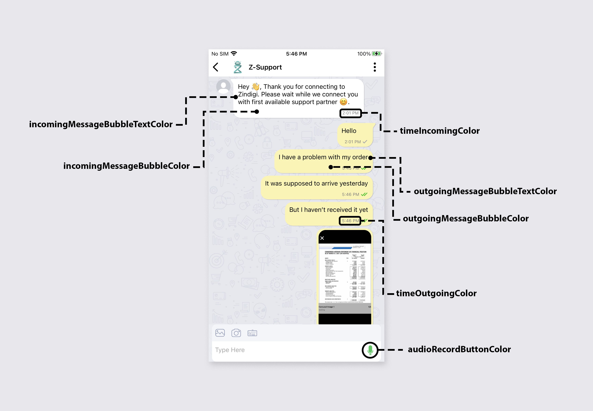

# TelloTalk Android Chat SDK

TelloTalk Android Chat SDK is a comprehensive solution for integrating a ready-made chatting system into your Android applications seamlessly.

## Features

- Easy integration for instant messaging functionality.
- Customizable UI elements for a personalized chat experience.
- Support for multimedia messaging, including text, images, videos, and files.
- Real-time updates and notifications for an interactive user experience.

## Requirements

To use the SDK, you'll need the following:

- **Access Key**: `<YOUR_ACCESS_KEY>`
- **Project Token**: `<YOUR_PROJECT_TOKEN>`

## Installation
Installation can be done either remotely via maven or using aar locally.

### 1. Maven Integration(Recommended)

To integrate via Maven, add the following dependency in your app's `build.gradle` file:

Add the token to $HOME/.gradle/gradle.properties

```gradle
authToken=jp_p6dmteat0vu8e805pm7dl1k5c0
```

```gradle
dependencies {
    implementation 'com.github.tellotalksdk:tellotalksdk_corporate_chat:3.10.4'
}
```

Ensure that you have the Maven repository URL added to your project's repositories in Project level `build.gradle` file:

```gradle
allprojects {
    repositories {
        ...
        maven {
            credentials { username authToken }
        }
    }
 }
```

### 2. AAR File Integration

Download the AAR file from the following link:
[Version 3.10.4](https://github.com/TelloTalk/AndroidSDKs/blob/main/ChatSDK/tellotalksdk-3.10.4.aar)

To integrate using the AAR file, follow these steps:
1. Copy the downloaded AAR and sources file into your project's `libs` directory.
2. Open your app level `build.gradle` file and add the following dependency:

```gradle
dependencies {
    implementation files('libs/tellotalksdk.aar')
}
```

3. In order for local aar to work you need to add it's dependencies in your app level `build.gradle` file

```gradle
    //SDK dependencies
    implementation fileTree(include: ['*.aar'], dir: 'libs')
    implementation files('libs/tellotalksdk.aar')
    implementation('com.facebook.fresco:fresco:3.6.0'){
        exclude group: 'com.facebook.fresco', module: 'animated-base'
        exclude group: 'com.facebook.fresco', module: 'animated-drawable'
        exclude group: 'com.facebook.fresco', module: 'animated-gif'
        exclude group: 'com.facebook.fresco', module: 'animated-webp'
        exclude group: 'com.facebook.fresco', module: 'nativeimagefilters'
        exclude group: 'com.facebook.fresco', module: 'memory-type-native'
        exclude group: 'com.facebook.fresco', module: 'soloader'
    }
    implementation("com.squareup.okhttp3:okhttp-urlconnection:5.3.2")
    implementation 'androidx.room:room-runtime:2.8.4'
    implementation 'androidx.room:room-common-jvm:2.8.4'
    ksp 'androidx.room:room-compiler:2.8.4'
    implementation 'org.jsoup:jsoup:1.21.2'
    implementation 'pl.droidsonroids.gif:android-gif-drawable:1.2.29'
    implementation ('io.socket:socket.io-client:2.1.2') {
        exclude group: 'org.json', module: 'json'
    }
```

## Implementation Guide

To implement the SDK within your app, follow these steps:
1. **Initialize the SDK**

    ```kotlin
            
            // Initialize the SDK
            val builder = TelloApiClient.Builder()
                                            .accessKey("<YOUR_ACCESS_KEY_HERE>")
                                            .projectToken("<YOUR_PROJECT_TOKEN_HERE>")
                                            .CRYPTO_LIB_KEY("<USE_PROVIDED_VALUES>")
                                            .CRYPTO_LIB_IV("<USE_PROVIDED_VALUES>")
                                            .setApplicationContext(getApplicationContext())
                                            .notificationIcon  ("<PROVIDE_DRAWABLE_RESOURCE_FOR_ICON_HERE>")
                                            .showSnack(false)
                                            .telloApiClient.setGoogleApiKey(getString(R.string.API_KEY));//optional
                                            
            //build sdk into singleton object to reference later
            telloApiClient = builder.build()

    ```

2. **Register SDK with a user** 

   Initiate SDK with a user to start receiving messages and to access chat interface (This is typically done in your main activity where you have access to uniquely identify your users.):

    ```kotlin
    fun registerUser(
        profileId:String,
        name: String?="",
        mobileNumber: String?="",
        customerType: String?= "",
        fcmToken: String?="",
        successListener: (OnSuccessListener<String?>)? = null
    )
                              
    ```
   `OnSuccessListener` will return if user is register or not. If this method returns string "200", SDK will start receiving messages and you can access SDK user interface when needed.

## TelloTalkSdk UI configurations

Following properties should be configured properly before entering the SDK UI:

1. Indicates whether `bundledMessage` should be shown in the SDK UI
    ```kotlin
   var showBundledMsg = false
   ```
2. Indicates whether the large send button should be shown in the SDK UI.
   ```kotlin
   var showLargeSendButton = true
   ```
3. Indicates whether the SDK UI should show previous messages only.
   ```kotlin
   var showPreviousMessagesOnly = false
   ```
4. Indicates whether the default SDK popup would appear after the `openConversation` method has been called.
   ```kotlin
   var showDepartmentListDialog = false
   ```
5. This method sets the activity of the host app which should be opened when the user clicks on the notification or TelloSdk activity finishes but the host activity has been destroyed or is not created
   ```kotlin
   /**
   * Example:
   * returnActivityName(this.javaClass.name) -> in any activity class
   */
   fun returnActivityName(activityName: String?)
   ```
6. This method is used to set the language of the sdk. Current supported values are "en" for English and "ur" for Urdu
   ```kotlin
   fun setLocality(lang: String?)
   ```

## Ways to enter TelloTalkSdk UI

If the `showDepartmentListDialog` is set to `false` use this method to fetch the departments and show in a custom UI:
```kotlin
    fun getDepartmentList(successListener: OnSuccessListener<List<Department>>?)
```
The `OnSuccessListener` will return the list of departments

In order to open the chat for the two way department type use the following method:
```kotlin
    fun openConversation(activity: Activity, bundledMessage: String, extraMessage:String, department: Department? = null)
```

In order to open the screen for one way department type use the following method:
```kotlin
    fun openAnnouncements(activity: Activity, department: Department)
```
If user is not loggedIn or feature is not provided, method will throw IllegalStateException.


## Receive and display unread message count

You can get unread messages count for chat and announcement messages 
outside the sdk by implementing this Listener in your activity or fragment:

```kotlin
interface MessageCounterListener {
   fun onMessageCountUpdate(count:Int)
   fun onAnnouncementCountUpdate(count:Int)
}
```
And then calling this method to set the listener
```kotlin
fun setMessageCounterListener(messageCounterListener: MessageCounterListener?)
```

## Receiving Message Notifications using FCM

To receive notification using FCM you need to call this method inside the onMessageReceived callback of your FCM Service :
```kotlin
    override fun onMessageReceived(remoteMessage: RemoteMessage) {
       telloApiClient.showFcmNotification(data = remoteMessage.data, context = this)
    }
```

To open the SDK screen directly from the notification, call the following method from the activity that is set as the `returnActivityName`:

```kotlin
 fun launchConversationFromNotification(activity: Activity,profileId: String)
```
For example:
```kotlin
override fun onCreate(savedInstanceState: Bundle?) {
    //...
   if(intent.extras?.getBoolean("fromNotification")==true){
      intent.extras?.clear()
      MyApplication.instance?.telloApiClient?.launchConversationFromNotification(this@HomeActivity,prefs?.getString("profileId","")?:"")
   }
}
```

## Get Broadcast event from FormattedView

Get Event from broadcast message in One Way Communication by implementing the following interface.
```java
public interface AnnouncementSelectionListener {
   void onAnnouncementClicked(String message_id, String broadcastFrom, String message_type, String campaignId);
}
```
And setting it using the following method:
```kotlin
fun setAnnouncementCLickedListener(
        listener: AnnouncementSelectionListener
    )
```

### Color Changes on UI interface

UI Customization
```xml
     <color name="toolbar_color">#fdfdfc</color>
<color name="toolbar_title_text_color">#000000</color>
<color name="outgoingMessageBubbleColor">#FBF39A</color>
<color name="outgoingMessageBubbleTextColor">#FBF39A</color>
<color name="incomingMessageBubbleColor">#FBF39A</color>
<color name="incomingMessageBubbleTextColor">#FBF39A</color>
<color name="indicator">#009688</color>
<color name="float_buttons">#009688</color>
<color name="submit_button_vote">#FFE500</color>
<color name="timeOutgoingColor">#000000</color>
<color name="timeIncomingColor">#000000</color>
<color name="audioRecordButtonColor">#ffc62828</color>
<color name="messageButtonColor">#ffc62828</color>
```


```

